> 在线项目网址
>
> https://codesandbox.io/s/competent-panini-x6wmz

https://codesandbox.io/s/react-geek-time-forked-38osj?file=/src/index.js

#   ---------  第一章  React基础--------

# 01  React出现的历史背景及特性介绍

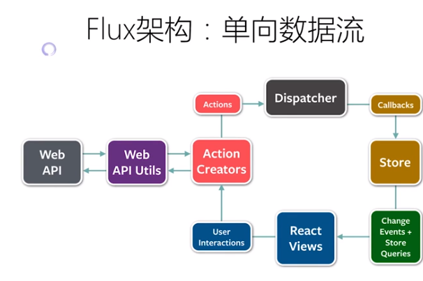

Flux 的架构衍伸框架  Redux

React :  始终整体刷新页面

Flux：单向数据流

# 02 以组件方式考虑UI的构建

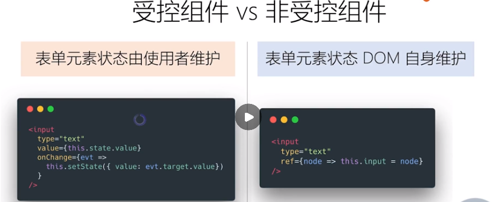

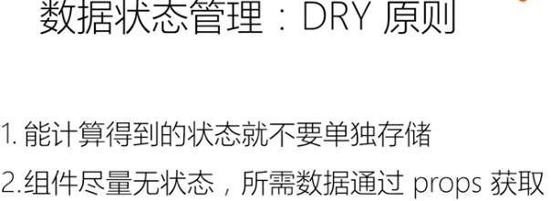

# 03 JSX的本质：不是模板引擎，而是语法糖

**JSX** ： 在javaScript 代码中直接写HTML标记

**JSX** 的本质: 动态创建组件的语法糖

 

JSX优点

1. 声明式创建界面的直观
2. 代码动态创建界面的灵活
3. 无需学习新的模板语言

# 04 React组件的生命周期及其使用场景

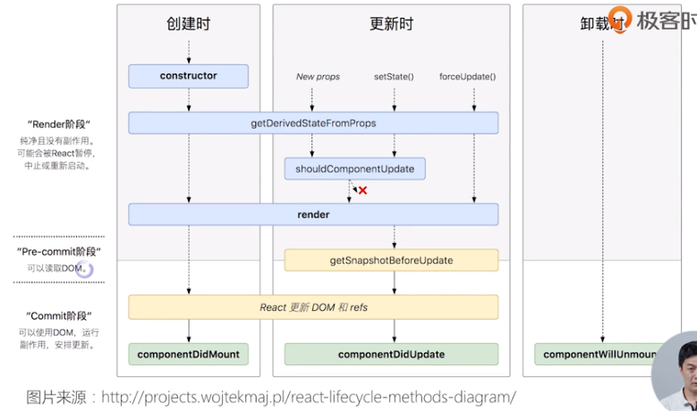

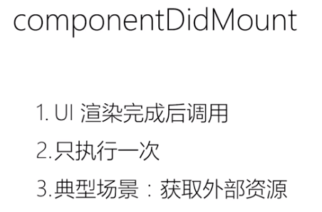

# 05 理解 Virtual DOM 及 key属性的作用

https://zh-hans.reactjs.org/docs/reconciliation.html

JSX的运行基础：Virtual DOM

**虚拟DO是如何工作的**

1. 广度优先分层比较

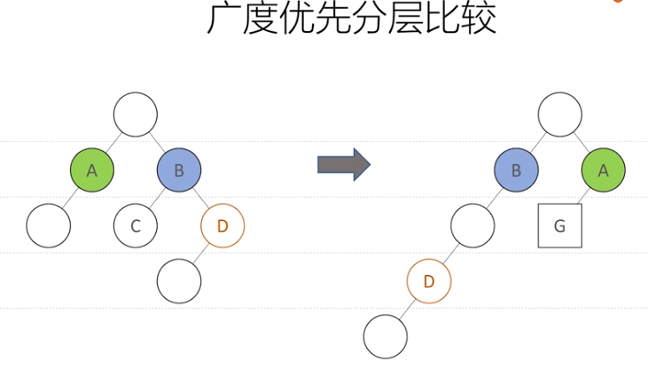

**虚拟DOM 的两个假设**

1. 组件的DOM 结构是相对稳定的
2. 类型相同的兄弟节点可以被唯一标识

**小结**

1. 算法复杂度O(n)
2. 虚拟DOM如何计算diff
3. key属性的作用

# 06 组件设计模式：高阶组件和函数作为子组件

组件复用的另外两种形式：

1. 高阶组件
2. 函数作为子组件

**小结**

1. 高阶组件和函数子组件都是设计模式
2. 可以实现更多场景的组件复用

# 07 理解Context API 及其使用场景

> Context API 解决组件之间通讯的问题

React 16.3  新特性 :Context API

**provide/consume**

consume 必须放在provide 之内，否者就是默认值

# 08 使用脚手架工具创建React项目

使用脚手架工具创建React应用

1. Create React APP
2. Codesandbox
3. Rekit

###  1 为什么需要脚手架工具

1. React  做界面UI的开发
2. Redux 做状态的管理
3. React/Router  做路由的管理
4. Babel  将最新的特性翻译成浏览器可以执行的旧的javaScript的语法
5. webpack 进行打包
6. ESLint  做语法检查

### 2 Create-react-app

> 相当于一个最小化的构建

### 3  Rekit

> 可以作为一个较大的项目的构建
>
> 适合中大型单页应用

### 4 Codesandbox.io

> 一个线上的项目构建

# 09 打包和部署

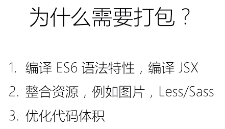

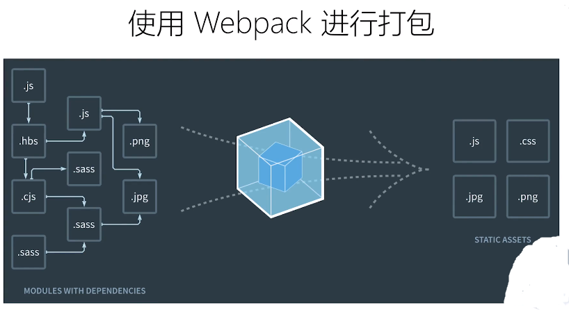

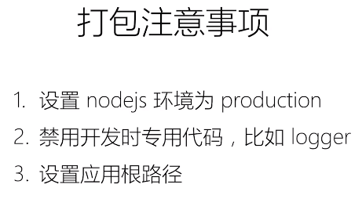

# ---------

# --------   第二章  React生态圈----------

# 10 Redux（1）： 前端为何需要状态管理库

> Redux（1）： JS 状态管理框架

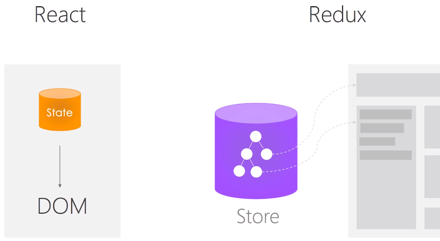

>  Store 负责管理所有的全局的状态

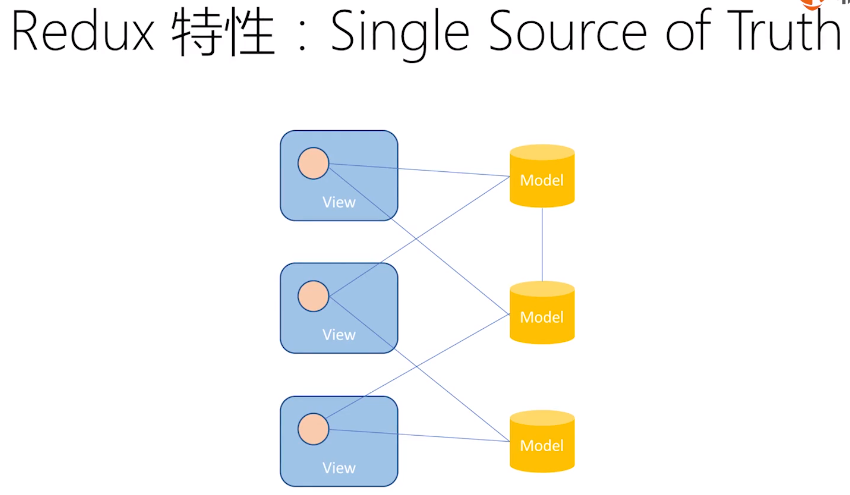

# 11 Redux （2）：深入了解Store、Action、Reducer

# 12 Redux（3）：在React中使用Redux

# 13 Redux （4）：理解异步Action、Redux中间件

Redux 的浏览器插件

--- 小结 ---

1. 异步action不是特殊action,

   而是多个同步action的组合使用

2. 中间件在dispatcher 中截获action做特殊处理

# 14 Redux （5）：如何组织Action和reducer

一个文件一个Action

# 15 Redux （6）：理解不可变数据（Immutability）

# 16 React Router （1）：路由不只是页面切换，更是代码组织方式

# 17 React Router （2）：参数定义，嵌套路由的使用场景

# 18 UI组件库对比和介绍：Ant.Design、Material UI、Semantic UI

Ant.Design：组件类库齐全，界面偏向企业化

Material UI :  界面时尚，组件可能有缺失

Semantic UI ：自定义了许多的stye 文件，可以自己进行UI的实现

# 19 使用Nexti.js 创建React同构应用

next.js  中可以通过 **prefetch**  属性进行  关于当前连接的资源 进行预加载

动态加载页面

# 20 使用Jest、Enzyme等工具进行单元测试

# 21 常用开发调试工具：ESLint、Prettier、React DevTool、Redux DevTool

# ------- 第三章  构建可维护可扩展的前端应用  -------

# 22 前端项目的理想脚骨：可维护、可扩展、可测试、易开发、易构建

>  Rekit 让理想成为现实~

 

# 23 拆分复杂度（1）：按领域模型（feature）组织代码，降低耦合度

<h1> 项目初期 ：规模小，模块关系清晰 </h1>

<h1>项目逐渐复杂，添加了更多组件和其他元素</h1>

<h1> 项目收尾：文件结构，模块依赖错综复杂</h1>

<h1> ** 解决方案 **： 将业务逻辑拆分成高内聚松耦合的模块 </h1>

将整个应该按照业务功能进行拆分，每一个功能就是一个 Feature 1

# 24 拆分复杂度（2）：如何组织component、action和reducer

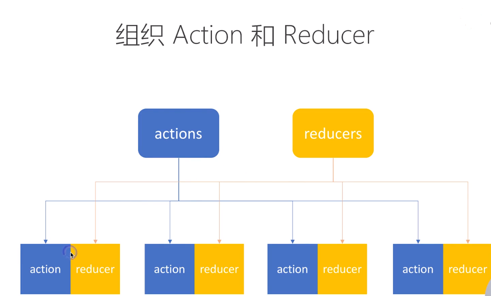

<h1>每一个feature里面定义一个常量文件</h1>

# 25 拆分复杂度（3）：如何组织React Router的路由配置

# 26 使用Rekit（1）：创建项目，代码生成和重构

# 27 使用Rekit（2）：遵循最佳实践，保持代码一致性

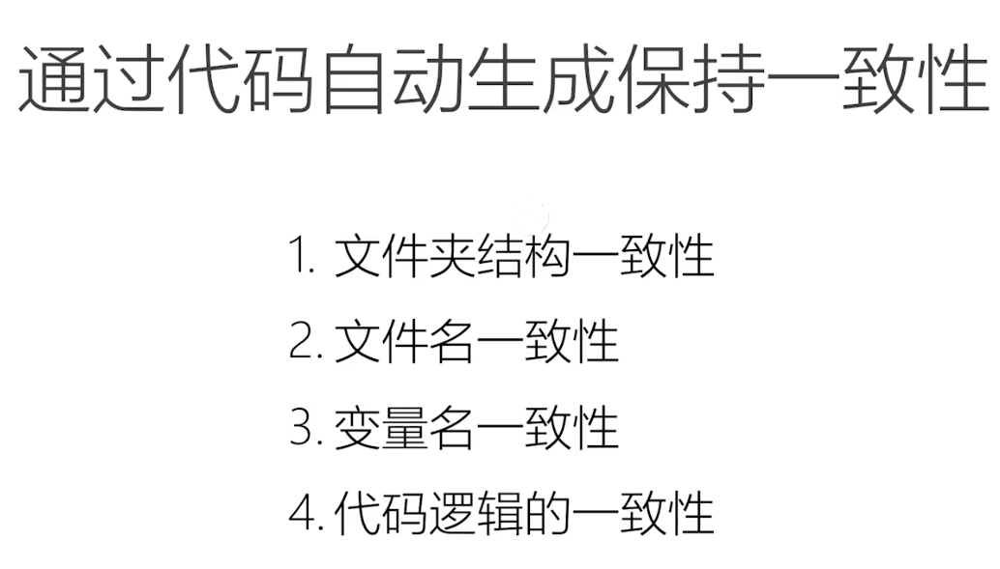

# ------- 第四章  常见场景的最佳实践  -------

# 28 使用React Router管理登录和授权

# 29 实现表单（1）：初始数据，提交和跳转

> 主要以Ant-Desgin 的表单进行实现
>
> 可以对Ant-Desgin进行二次封装

# 30 实现表单 （2）：错误处理，动态表单元素，内容动态加载

# 31  列表页（1）：搜素，数据缓存和分页

# 32 列表页（2）：缓存更新，加载状态，错误处理

# 33 页面数据需要来源多个请求的处理

