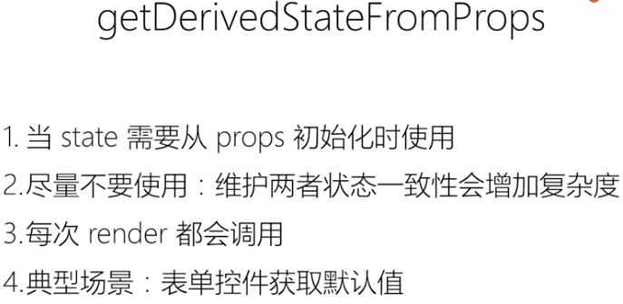

#   ---------  第一章  React基础--------

# 01  React出现的历史背景及特性介绍

Flux 的架构衍伸框架  Redux

React :  始终整体刷新页面

Flux：单向数据流

# 02 以组件方式考虑UI的构建

# 03 JSX的本质：不是模板引擎，而是语法糖

**JSX** ： 在javaScript 代码中直接写HTML标记

**JSX** 的本质: 动态创建组件的语法糖

 

JSX优点

1. 声明式创建界面的直观
2. 代码动态创建界面的灵活
3. 无需学习新的模板语言

# 04 React组件的生命周期及其使用场景

# 05 理解 Virtual DOM 及 key属性的作用

https://zh-hans.reactjs.org/docs/reconciliation.html

JSX的运行基础：Virtual DOM

**虚拟DO是如何工作的**

1. 广度优先分层比较

**虚拟DOM 的两个假设**

1. 组件的DOM 结构是相对稳定的
2. 类型相同的兄弟节点可以被唯一标识

**小结**

1. 算法复杂度O(n)
2. 虚拟DOM如何计算diff
3. key属性的作用

# 06 组件设计模式：高阶组件和函数作为子组件

组件复用的另外两种形式：

1. 高阶组件
2. 函数作为子组件

**小结**

1. 高阶组件和函数子组件都是设计模式
2. 可以实现更多场景的组件复用

# 07 理解Context API 及其使用场景

> Context API 解决组件之间通讯的问题

React 16.3  新特性 :Context API

**provide/consume**

consume 必须放在provide 之内，否者就是默认值

# 08 使用脚手架工具创建React项目

使用脚手架工具创建React应用

1. Create React APP
2. Codesandbox
3. Rekit

###  1 为什么需要脚手架工具

1. React  做界面UI的开发
2. Redux 做状态的管理
3. React/Router  做路由的管理
4. Babel  将最新的特性翻译成浏览器可以执行的旧的javaScript的语法
5. webpack 进行打包
6. ESLint  做语法检查

### 2 Create-react-app

> 相当于一个最小化的构建

### 3  Rekit

> 可以作为一个较大的项目的构建
>
> 适合中大型单页应用

### 4 Codesandbox.io

> 一个线上的项目构建

# 09 打包和部署

# ---------

# --------   第二章  React生态圈----------

# 10 Redux（1）： 前端为何需要状态管理库

> Redux（1）： JS 状态管理框架

>  Store 负责管理所有的全局的状态

# 11 Redux （2）：深入了解Store、Action、Reducer

# 12 Redux（3）：在React中使用Redux

# 13 Redux （4）：理解异步Action、Redux中间件

Redux 的浏览器插件

--- 小结 ---

1. 异步action不是特殊action,

   而是多个同步action的组合使用

2. 中间件在dispatcher 中截获action做特殊处理

# 14 Redux （5）：如何组织Action和reducer

一个文件一个Action

# 15 Redux （6）：理解不可变数据（Immutability）

# 16 React Router （1）：路由不只是页面切换，更是代码组织方式

# 17 React Router （2）：参数定义，嵌套路由的使用场景

